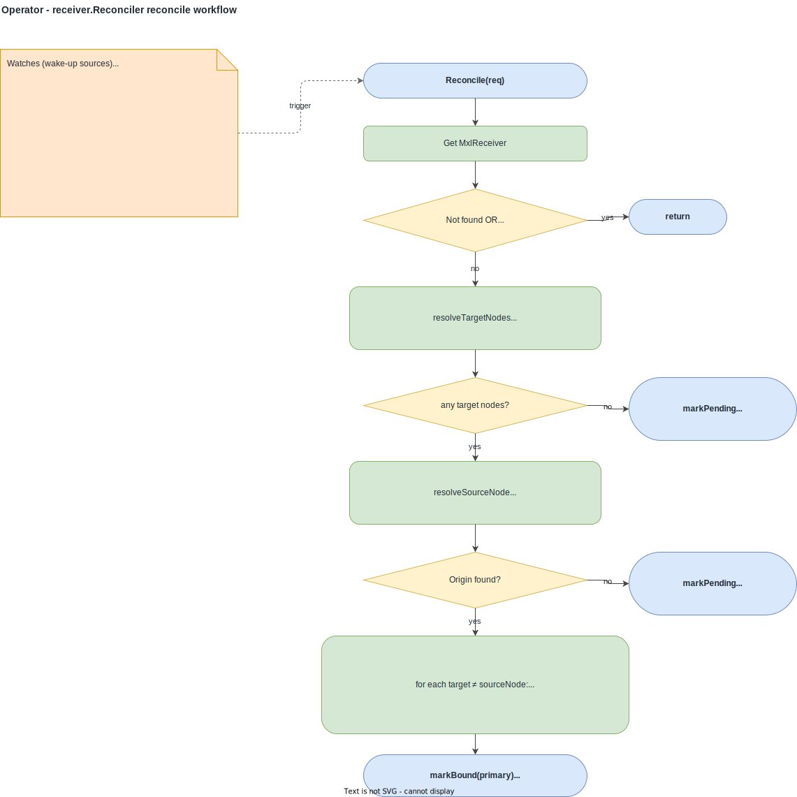
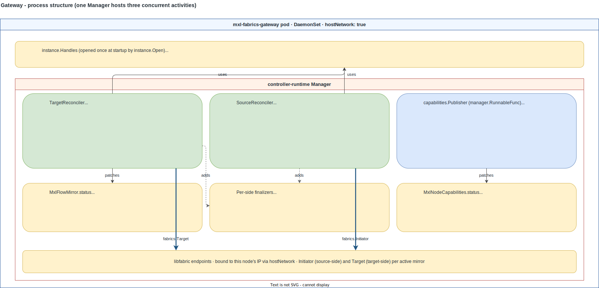
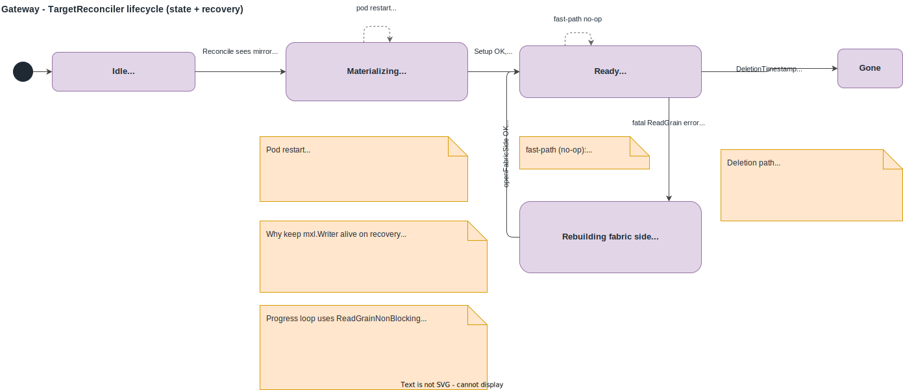
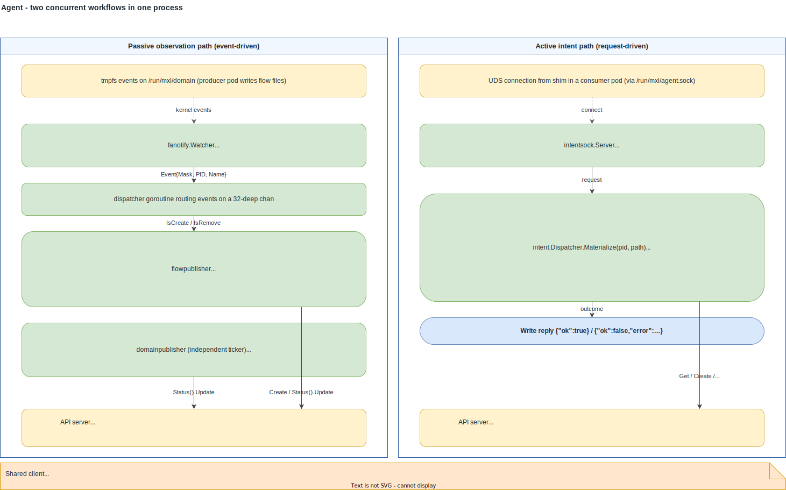
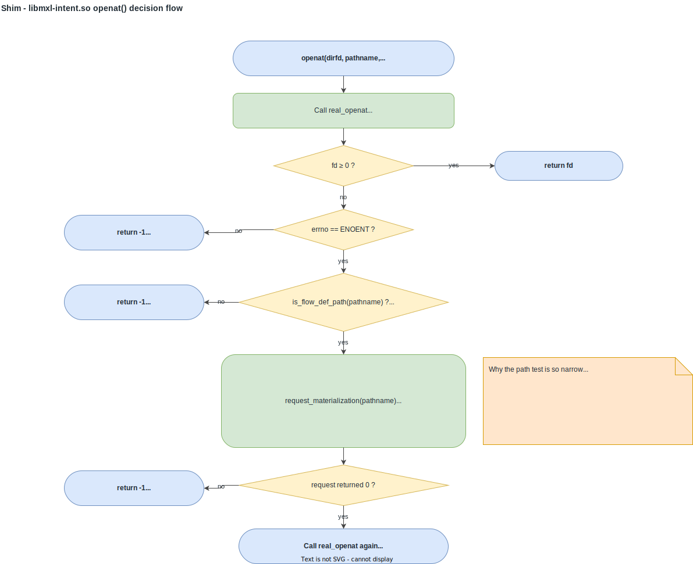
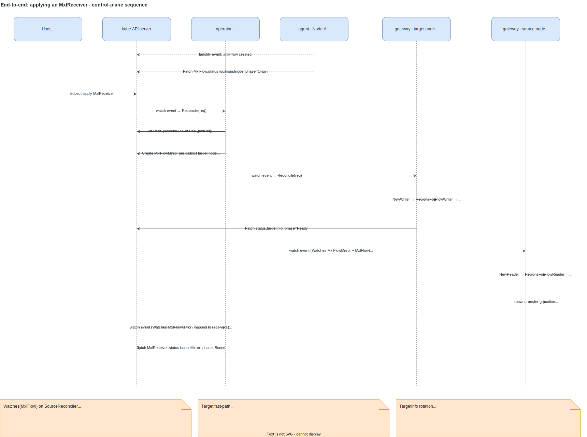

# Components

mxl-k8s ships four runtime artefacts plus one wire-contract package.
Each owns a specific slice of state and watches a specific set of CRDs.
This page steps through them in turn -- one focused diagram per
component, showing the workflow rather than a labelled rectangle.

## CRD ownership at a glance

| CRD | Scope | Spec written by | Status written by | Watched by |
| --- | --- | --- | --- | --- |
| `MxlReceiver` | Namespaced | user | operator | operator |
| `MxlFlowMirror` | Namespaced | operator (declarative) or agent (intent) | gateway (target side) | operator, gateway (target + source), agent |
| `MxlFlow` | Cluster | agent (on first appearance) | agent | operator, gateway (source side), agent |
| `MxlDomain` | Cluster (per-node) | bootstrap / agent | agent | operator (observe), agent |
| `MxlNodeCapabilities` | Cluster (per-node) | gateway | gateway | operator (observe), gateway |

The RBAC verbs that encode this table live in
`+kubebuilder:rbac` markers next to each reconciler -- most
authoritatively
[`operator/internal/receiver/controller.go:35-40`](../../operator/internal/receiver/controller.go)
and
[`gateway/internal/mirror/target.go:81-84`](../../gateway/internal/mirror/target.go).

## Operator

`operator/cmd/mxl-operator` -- single Deployment, cluster-scoped,
leader-elected (`LeaderElectionID:
"mxl-operator.mxl.qvest-digital.com"`,
[`main.go:56`](../../operator/cmd/mxl-operator/main.go)).
One controller-runtime Manager hosts five reconcilers; only one of
them mutates state, and that's the one that matters here:

The four other reconcilers (`flow`, `mirror`, `domain`, `nodecaps`)
register at startup but log only -- they're observer code paths that
exist to mark the reconciler scaffolding so future status-aggregation
work has a hook. They write nothing.

Two correctness details worth flagging while looking at the diagram:

- The `Watches(MxlFlowMirror)` arm
  ([`controller.go:261`](../../operator/internal/receiver/controller.go))
  maps mirror events back to receivers by `spec.flowID`. Without it,
  the receiver would not notice a bound mirror being deleted (manual
  cleanup, future garbage collection) until the 10-hour cache resync.
- `mirrorName(flowID, targetNode)`
  ([`controller.go:214`](../../operator/internal/receiver/controller.go))
  is byte-for-byte identical to `MirrorName` in
  [`agent/internal/intent/dispatcher.go:238`](../../agent/internal/intent/dispatcher.go).
  This is what makes the declarative path (operator) and the
  on-demand path (agent) converge on a single `MxlFlowMirror` per
  (flow, target node) instead of racing each other.

## Gateway

`gateway/cmd/mxl-fabrics-gateway` -- DaemonSet, `hostNetwork: true`.
A single controller-runtime Manager hosts three concurrent
activities, sharing one libmxl + libmxl-fabrics handle pair:

The two reconcilers are filtered on `spec.targetNode` and
`spec.sourceNode` respectively. They operate on disjoint mirror sets
(one mirror has exactly one of each), and they own their own
finalizers -- so libmxl + libfabric handles get torn down before the
CR disappears, regardless of which side the gateway is acting on.

The target-side lifecycle is worth its own diagram because the
recovery path is non-obvious: a fatal `ReadGrain` error rebuilds the
fabric side *without* closing the `mxl.Writer`, so consumer pods'
`FlowReader` handles stay valid across the recovery.

Two transitions in particular are easy to miss:

- **Pod restart** lands in `Materializing` again, not `Ready` -- the
  in-memory `targetEntry` map is empty after restart, the fast-path
  declines, and the slow path reopens the writer. This also rotates
  `TargetInfo`, which the source side picks up through its
  `Watches(MxlFlowMirror)`.
- **Fatal `ReadGrain`** triggers `recoverFromFatalError`
  ([`target.go:375`](../../gateway/internal/mirror/target.go)),
  which closes only the fabric triple
  (`Regions`/`Target`/`Info`). The `mxl.Writer` is intentionally
  retained -- the on-disk flow definition and any consumer
  `FlowReader` handles point at it.

The choice of `ReadGrainNonBlocking` over the blocking variant is
explained alongside the data-plane sequence in
[03-node-anatomy](./03-node-anatomy.md#end-to-end-a-grain-in-flight);
the short version is that Go's SIGURG-based preemption interacts
badly with libfabric's `util_wait.c` EINTR handling on release
builds.

## Agent

`agent/cmd/mxl-domain-agent` -- DaemonSet. Two concurrent workflows
share a controller-runtime `client.Client` but are otherwise
independent -- fanotify can run with the intent socket disabled (set
`--intent-socket-path=""`) and vice versa.

The active intent path's `ensureMirror`
([`dispatcher.go:157`](../../agent/internal/intent/dispatcher.go)) is
the second producer of `MxlFlowMirror` resources (the first being
the operator). The two paths converge on a single CR per
(flow, target node) because `MirrorName` is the same algorithm.
The difference visible in the API is the `spec.requestor` field:
intent-path mirrors carry the requesting Pod's `name`/`namespace`/
`uid`, declarative-path mirrors leave it nil.

`waitReady`
([`dispatcher.go:203`](../../agent/internal/intent/dispatcher.go))
polls the mirror's status with a default 5-second cap; if the
gateway's target side doesn't reach `phase=Ready` within that
window, the agent's UDS reply is `{"ok":false,"error":"context
deadline exceeded"}` and the shim propagates `ENOENT` to the
caller. The consumer pod's libmxl then retries the open on its own
schedule.

## Shim

`shim/libmxl-intent.c` -- a tiny LD_PRELOAD library. No CRD access,
no Kubernetes client, no daemon -- it speaks only to the local
agent's UDS.

The narrowness of the path test is deliberate: the shim is loaded
into every process the consumer pod runs, including the dynamic
linker's own probes for libc / libpthread / locale files / config
under `/etc`. `is_flow_path` is a pure string check (no syscall),
so the cost on the hot path for every unrelated call is a handful
of memcmps.

Five libc entry points carry the hook: `openat`, `open`, `access`,
`stat`, and `lstat`. libmxl uses `access` and `stat` to probe the
`.mxl-flow` directory and the access file before it ever calls
`open` for `flow_def.json`, so hooking `openat` alone would leave
the first probe returning ENOENT and `mxlCreateFlowReader` would
report `FLOW_NOT_FOUND` without the shim having a chance to wake
the agent.

The decision to use LD_PRELOAD rather than a kernel-level mechanism
is forced by what libmxl exposes:

- libmxl has no "flow not present" callback hook on the FlowReader
  side -- it just returns `FLOW_NOT_FOUND`.
- fanotify `FAN_OPEN_PERM` would let us intercept `open` syscalls
  with a permission decision, but the kernel only consults
  permission events for paths that resolve to an inode. An `openat`
  that's about to return `ENOENT` never fires the event.
- Intercepting libc symbols in userspace, scoped to paths under
  `<id>.mxl-flow`, is the simplest place where the shim can both
  see the attempted call *and* re-issue it after the agent has
  materialised the file.

## End-to-end: applying an `MxlReceiver`

The per-component workflows above describe what each process does in
isolation. This sequence shows how they line up in time when a user
applies an `MxlReceiver` and a cross-node mirror reaches `Ready`.
The intent-driven path (LD_PRELOAD shim -> agent UDS) joins at step
5 -- the agent and the operator's reconciler use the same
deterministic `MirrorName`, so the on-demand path and the
declarative path converge on a single `MxlFlowMirror`.

The eight steps in order:

1. **Producer pod starts on Node A.** libmxl creates
   `<flowID>.mxl-flow/{flow_def.json,data,grains/}` under
   `/run/mxl/domain`. mxl-k8s does not observe this directly.
2. **Node-A agent's fanotify watcher fires** for the new directory
   entry. `flowpublisher.PublishAppeared` reads `flow_def.json`,
   creates the cluster-scoped `MxlFlow` if absent, and patches
   `status.locations` to record `{nodeName: nodeA, phase: Origin}`.
   `Origin` vs `Ready` is decided by whether an `MxlFlowMirror`
   already names this node as `target`: producer-side directories
   get `Origin`, mirror-target directories get `Ready` so
   `resolveSourceNode` keeps pointing at the real writer.
3. **User applies an `MxlReceiver`.** Spec carries `flowID` plus
   exactly one of `podSelector` / `podRef`.
4. **Operator's `receiver.Reconciler` wakes** on the watch event,
   resolves target pods, dedupes them by node, and looks up the
   origin from `MxlFlow.status.locations[Origin]`. If either side
   isn't ready, it sets `phase=Pending` with a 10s requeue and
   exits.
5. **Operator creates one `MxlFlowMirror` per distinct target
   node.** Mirrors where `target == sourceNode` are skipped -- the
   writer's own node already has the flow.
6. **Target-node gateway's `TargetReconciler` wakes** on the
   `MxlFlowMirror` event and walks the libmxl-fabrics handshake:
   `mxl.Instance.NewWriter` -> `fabrics.RegionsForFlowWriter` ->
   `fabrics.Instance.NewTarget` -> `Target.Setup` ->
   `TargetInfo.MarshalString`. It patches
   `MxlFlowMirror.status.targetInfo` and `phase=Ready`, then starts
   the progress goroutine.
7. **Source-node gateway's `SourceReconciler` wakes** on the
   mirror's status update -- it has `Watches(MxlFlowMirror)` *and*
   `Watches(MxlFlow)`. It opens
   `mxl.Instance.NewReader` ->
   `fabrics.RegionsForFlowReader` -> `fabrics.Instance.NewInitiator`
   -> `Initiator.Setup` -> `ParseTargetInfo` -> `AddTarget`, then
   spawns the transfer goroutine.
8. **Operator's `receiver.Reconciler` wakes** on the mirror's
   status update via its `Watches(MxlFlowMirror)` and patches
   `MxlReceiver.status` with `boundMirror` and `phase=Bound`.

Failure modes:

- **No origin location for the requested flow.** Receiver sits in
  `phase=Pending` with reason `"MxlFlow not yet known or no Origin
  location"`. Common during startup races; the receiver reconciles
  again every 10s and on every `MxlFlow` change.
- **No scheduled pods match the selector.** Same `phase=Pending`
  with a different reason. The receiver reconciler does not watch
  Pods, so it relies on the periodic requeue.
- **Target gateway crashes between status update and progress
  goroutine start.** On restart, the fast-path's "live in-memory
  entry" requirement fails; the reconciler reopens and rotates
  `TargetInfo`. The source side picks up the rotation via its
  watch.
- **libfabric peer drops mid-stream.** Target's `ReadGrain` returns
  a non-recoverable error; the progress goroutine exits and
  `recoverFromFatalError` rebuilds the fabric side while keeping
  the local `mxl.Writer` alive so consumer `FlowReader` handles
  remain valid.
