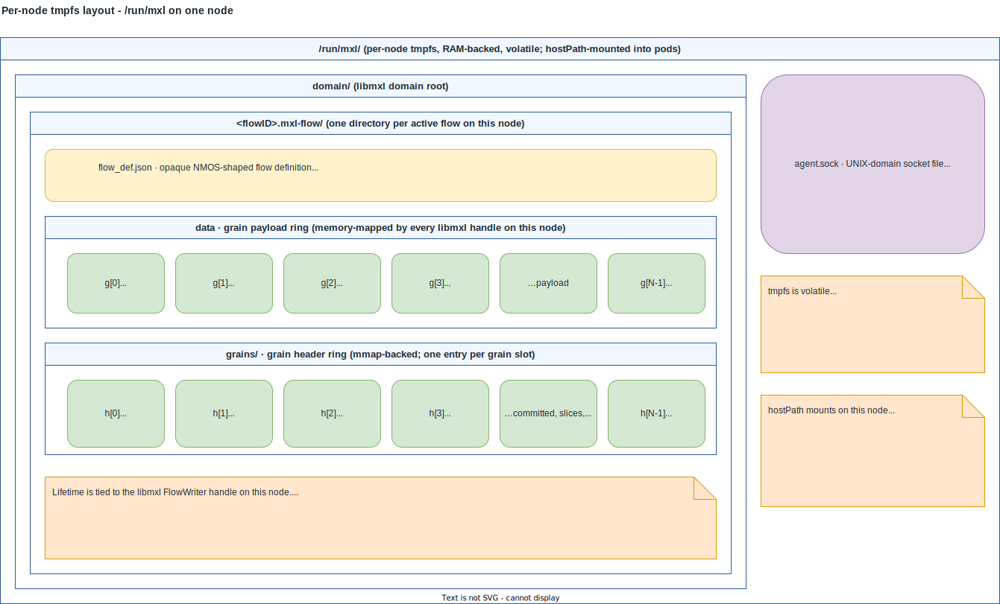
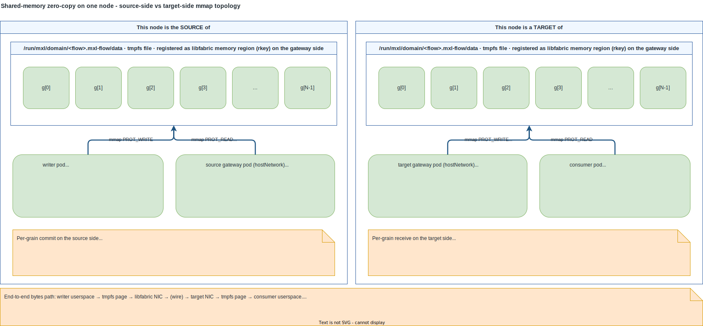
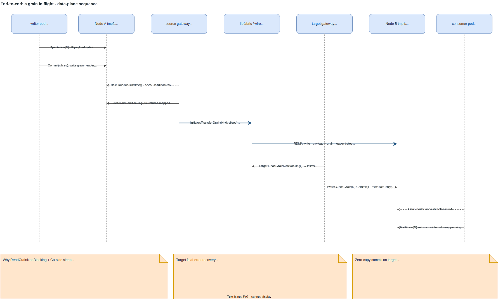

# Per-node anatomy

[01-system-context](./01-system-context.md) showed which processes
live on a node; [02-components](./02-components.md) broke each
process down into the workflows it runs. This chapter covers the
one aspect those two skip: **how a single node's processes share
memory through tmpfs files, and how libmxl-fabrics registers a
slice of that memory for cross-node RDMA**. That sharing is what
makes mxl-k8s zero-copy on the data path.

## On-disk layout

Everything mxl-k8s touches on a node lives under `/run/mxl/`:

Three things matter here:

- **`/run/mxl` is a tmpfs**, not a backed mount. The bytes live in
  page-cache RAM. Nothing survives a node reboot. mxl-k8s does not
  provision the mount — that is left to the host's init system or a
  privileged bootstrap step. The agent reports the state it observes
  via `MxlDomain.status` (`capacityBytes`, `freeBytes`,
  `fanotifyReady`), but does not create the mount itself.
- **A flow directory's lifetime is tied to a libmxl FlowWriter
  handle.** `mxlCreateFlowWriter` creates
  `<flowID>.mxl-flow/{flow_def.json,data,grains/}`; closing the
  writer removes them. This is why the gateway's TargetReconciler
  recovery path keeps `mxl.Writer` alive even when the libfabric
  side died — releasing the writer would remove the on-disk flow
  definition and invalidate every consumer pod's `FlowReader`
  handle on the same node.
- **`agent.sock` is a per-node singleton.** The agent binds it at
  startup with mode `0666`; access control happens after `accept()`
  via `SO_PEERCRED` and the subsequent `podlookup.PodForPID` call,
  not via filesystem permissions. The socket file is bind-mounted
  into any consumer pod that uses the LD_PRELOAD shim.

## Shared-memory zero-copy

This is the central anatomical fact about a node and the reason
mxl-k8s exists as an *orchestration* layer rather than a transport
layer:

Two things to read out of the diagram:

- **All four roles map the same file.** The grain payload ring is
  one tmpfs file. The writer pod's libmxl `mmap`s it for writes;
  the consumer pod's libmxl `mmap`s it for reads; the gateway's
  libmxl handles `mmap` the same range from its own address space.
  No process holds an intermediate copy.
- **The gateway side, and only the gateway side, registers a
  libfabric memory region** over that mapping. libfabric needs to
  know the (virtual address, length, `rkey`) triple before a remote
  peer can RDMA into the region. Writer and consumer pods don't
  participate in libfabric at all — they only see the libmxl
  HeadIndex semantics.

The per-grain narrative captured in the diagram is the same one as
the data-plane sequence at the end of this chapter, but viewed from
a single node:

- **Source side.** Writer fills payload directly in tmpfs. Commit is
  one counter update. The source gateway, which maps the *same*
  tmpfs pages, polls `Reader.Runtime()` and sees the counter move
  with no copy or signal. `Initiator.TransferGrain` reads from its
  libfabric-registered region and emits an RDMA write.
- **Target side.** The RDMA write lands in this node's registered
  region, which *is* a slice of this node's tmpfs file. The target
  gateway calls `ReadGrainNonBlocking` to learn the index, then
  `Writer.OpenGrain(i).Commit` — a metadata-only HeadIndex bump
  because the payload bytes were already placed by RDMA. The
  consumer's `FlowReader` sees the HeadIndex move (same tmpfs
  pages, mapped read-only) and `GetGrain` returns a pointer into
  its own mapping.

There is exactly one moment in the whole pipeline where a process
*reads* bytes from a file backed by tmpfs: when the writer's libmxl
copies payload from the caller's buffer into the mapped slot, and
when the consumer's libmxl returns a pointer that the caller will
read from. Everything in between is pointer arithmetic and RDMA.

## Hostpath + shim injection at a glance

The mount and library-injection story is mechanical but worth a
table:

| Process | mounts `/run/mxl/domain` | mounts `/run/mxl/agent.sock` | linked / preloaded libraries |
| --- | --- | --- | --- |
| writer pod | rw | — | libmxl |
| consumer pod | rw | rw (bind-mount of the socket file) | libmxl + libmxl-intent.so via `LD_PRELOAD` |
| agent DaemonSet | rw | rw (binds, listens) | libmxl |
| gateway DaemonSet | rw | — | libmxl + libmxl-fabrics + libfabric provider |

The LD_PRELOAD shim is delivered through a small two-container
pattern: an initContainer copies the prebuilt `libmxl-intent.so`
into a shared `emptyDir`, the main container's
`LD_PRELOAD=/var/run/mxl-intent/libmxl-intent.so` (or
`MXL_INTENT_SOCK` plus a custom path) picks it up. The shim itself
has no daemon, no Kubernetes client, and no state — see
[02-components](./02-components.md#shim).

## Why these per-node choices

The hostNetwork rationale (libfabric MSG/RC endpoints need routable
IPs) lives in [01-system-context](./01-system-context.md#why-these-architectural-choices),
and the LD_PRELOAD-vs-kernel-hook rationale lives in
[02-components](./02-components.md#shim). What's unique to a node
view:

- **hostPath for `/run/mxl/domain`.** libmxl's domain is per-node
  by design: one tmpfs, one set of files, and every libmxl handle
  on the node maps the same memory. PersistentVolumes would mean
  per-pod views, which would defeat the zero-copy story.
- **Bind-mount of `/run/mxl/agent.sock` into consumer pods.** The
  alternative — a TCP listener on localhost — would force the shim
  to use a different syscall path and lose `SO_PEERCRED`-based
  caller identification. A UDS file fits the shim's "intercept one
  `openat` and block" model with minimal surface.
- **Volatile tmpfs is acceptable** because every flow exists in the
  cluster only while a writer is running. There is nothing to
  persist across reboots: when the writer pod comes back, it
  re-creates the flow files and the agent re-publishes the Origin
  location. The cluster does not assume any prior on-disk state.

## End-to-end: a grain in flight

Once a mirror has reached `phase=Ready` (see
[02-components](./02-components.md#end-to-end-applying-an-mxlreceiver)),
the control plane is out of the loop. Grains travel from the writer's
tmpfs domain on Node A to the consumer's tmpfs domain on Node B
without any further round-trips through the Kubernetes API.

Steps for one grain index *N*:

1. **Writer pod** calls `OpenGrain(N)` on its libmxl FlowWriter,
   fills the payload bytes directly into the mmap'd ring slot, and
   calls `Commit(slices, ...)`. The commit writes the grain header
   and advances the flow's `HeadIndex` in tmpfs.
2. **Source gateway's transfer goroutine** ticks (default 2 ms),
   reads the new `HeadIndex` from `Reader.Runtime()`, and for each
   `idx > lastSent` calls `GetGrainNonBlocking(idx)` followed by
   `Initiator.TransferGrain(idx, 0, slices)`. The grain is read
   from the gateway's mapping of the *same tmpfs file* — the
   bytes never leave RAM on this node.
3. **libfabric** performs an RDMA write into the target node's
   registered region. For the `tcp` provider this is a sequence of
   socket sends to the remote target; for `verbs`/EFA it is a real
   one-sided RDMA. In both cases the payload + grain header land
   *directly in the target's ring slot* — no intermediate buffer
   on the target gateway.
4. **Target gateway's progress goroutine** polls
   `Target.ReadGrainNonBlocking`. On success it returns the index
   that just completed; on `ErrNotReady` it sleeps 1 ms and loops.
5. **Target gateway** calls `commitArrivedGrain(writer, idx)`,
   which is `Writer.OpenGrain(idx)` followed immediately by
   `Commit(TotalSlices, 0)`. This does not copy data — the payload
   and header are already in place. The Commit only advances the
   local flow's `HeadIndex` so consumer FlowReaders on this node
   see the new grain.
6. **Consumer pod's FlowReader** sees `HeadIndex >= N` on its next
   `GetGrain(N)` call. The grain bytes are returned via a pointer
   into the consumer's mmap of the local data file — zero-copy on
   the consumer side as well.

Three details from the diagram are worth pulling out:

- **Why non-blocking `ReadGrain` on the target side**
  ([`target.go:285-293`](../../gateway/internal/mirror/target.go)).
  libfabric's `util_wait.c` returns `-EINTR` from `epoll_wait` as a
  fatal "poll failed" in release builds (the `EINTR` filter is
  gated on `#if ENABLE_DEBUG`). Go's async preemption sends SIGURG
  to running goroutines ~50/sec since Go 1.14, and that's the
  signal a blocking `ReadGrain` receives via the libfabric thread —
  tearing the endpoint down every 10–60 seconds in steady state.
  Polling from Go avoids blocking inside libfabric and sidesteps
  the signal-interaction. A workaround for the upstream libfabric
  bug is carried in libmxl fork PR #17, but the non-blocking path
  remains the correct shape regardless.
- **Why `Commit` is metadata-only on the target.** The payload +
  header bytes were RDMA'd into the ring slot by the remote
  initiator *before* `ReadGrain` reported the index as ready. What
  the local node's libmxl needs in order to surface the new grain
  to consumer FlowReaders is the `HeadIndex` bump, and
  `OpenGrain(N).Commit` is the path that performs it. This mirrors
  the receive pattern in upstream
  `mxl-fabrics-demo/tools/mxl-fabrics-demo/demo.cpp`.
- **Fatal-error recovery keeps `mxl.Writer` alive.** On any
  non-`ErrNotReady` error from `ReadGrain`, the target progress
  loop exits and `recoverFromFatalError(key)`
  ([`target.go:375`](../../gateway/internal/mirror/target.go))
  rebuilds only the fabric triple. The writer is retained so the
  on-disk flow definition and any consumer `FlowReader` handles
  point at it. The new `TargetInfo` is published into status; the
  source side detects the rotation through its existing watch and
  reopens its initiator.

There is no application-level backpressure on the source side: the
transfer goroutine forwards every grain it sees in
`Reader.Runtime().HeadIndex` order. If the network is the
bottleneck, libfabric's send queue absorbs the delta; if a target
is unreachable, `TransferGrain` errors are logged and the loop
continues, falling further behind the writer until the producer
wraps the ring and grains start being overwritten in tmpfs before
they're sent. Consumer reads honour libmxl's normal grain-ring
semantics — if the consumer is too slow it will start receiving
"grain aged out" errors from `GetGrain`. mxl-k8s does not
interpose on this; the ring is libmxl's, not ours.
